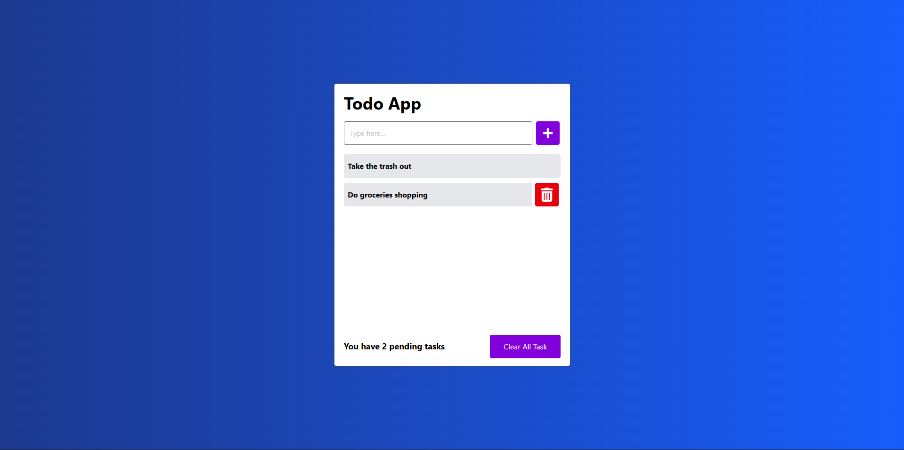

# ✅ To-Do List App (PERN Stack)


A simple **To-Do List** application built using the **PERN Stack: PostgreSQL, Express, ReactJS, and Node.js**.  
This project provides a hands-on approach to exploring CRUD operations with a real database.

---

## ✨ Features
- ➕ Add tasks
- 📝 Edit tasks
- ✅ Mark tasks as complete/incomplete
- ❌ Delete tasks
- 📦 Data persistence with PostgreSQL

---

## 🛠 Tech Stack
- **Frontend:** ReactJS + TailwindCSS
- **Backend:** Node.js + Express
- **Database:** PostgreSQL

---

## 🚀 Installation & Setup

### 1️⃣ Clone the Repository
```bash
git clone https://github.com/JuisLionel/login.git
```

## 2️⃣ Frontend Set up

1. Navigate to the frontend folder:
    ```bash
    Cd Frontend
    ```

2. Install the dependencies:
    ```bash
    npm install
    ```

3. Start the project:
    ```bash
    npm run dev
    ```

## 3️⃣ Backend Set up

1. Navigate to the Backend folder:
    ```bash
    Cd Frontend
    ```

2. Install the dependencies:
    ```bash
    npm install
    ```

3. Set up the env file
      ```bash
    PG_USER = PostgreSQL_Username
    PG_HOST = localhost
    PG_DATABASE = Database_Name
    PG_PASSWORD = PostgreSQL_Password
    PG_PORT = PostgreSQL_Port
    ```

4. Set up the PostgreSQL table 
      ```bash
      CREATE TABLE client_tb (
        index SERIAL PRIMARY KEY,
        task varchar(100) NOT NULL,
        finish BOOLEAN default FALSE
      );
    ```

5. Start the project:
    ```bash
    npm run dev
    ```


<br />

## 📸 Preview — Todo_list




## Note

1. To Mark tasks as complete/incomplete, you must double-click the task

2. If you want to exit edit, you can press Esc
